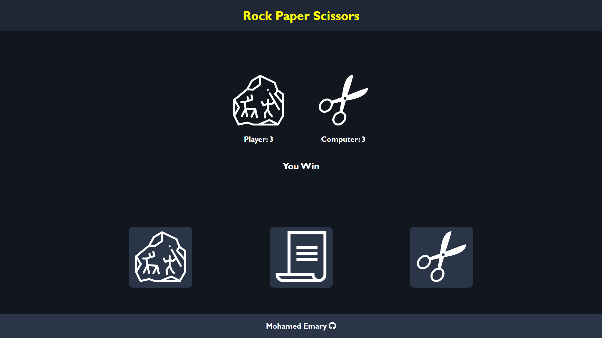

# Rock Paper Scissors

A simple rock paper scissors game website, presented as a project within The Odin Project web development curriculum.

In this website, I will apply what I have learned in JavaScript from [The Odin Project](https://www.theodinproject.com/) curriculum to create a this website.

## So what I have Learned so far?

- How to deal with **variables** in JavaScript
- **Operators** in JavaScript
- **Data types** in JavaScript
- **Comparison** and **conditional operators**
- **Truthy** and **falsy** values
- **Strings** & **string functions**
- How to use **browser developer tools** to view and change the DOM, View and edit HTML in the Elements tab, and to debug my JavaScript code
- different kinds of **functions** in JavaScript and how to use them
- Steps in the **problem solving** process
- Different kinds of **Javascript errors** and how to deal with them
- Tips on how to write **clean code**
- What is **Node.js and nvm**
- **Arrays** and **array methods** in JavaScript
- Different kinds of **loops** in JavaScript and how to use them
- **Test Driven Development (TDD)** and how to use it in my code
- What is **DOM** and how to **manipulate** it using JavaScript
- **Git branching** and how to use it in my projects
